# Collective Java IntelliJ GitHub Copilot Training

*Activity*: we have an old-webservice that managed the creation of movies, this must be migrate with Help of Copilot to a Spring Boot Application, adding unit testing and documentation.
First, we need to clone the repository: 
Every step has a branch with the solved step. 
The goal is to practice using the features that GH Copilot has for IntelliJ JetBrains today. (9/23/2024)

## Requirements

- Java 11
- Java 17 
- Maven
- Docker for Desktop (for run PostgreSQL)
- IDE (IntelliJ IDEA and Visual Studio Code)

## Step 1: Folder Structure

We start by creating our folder structure based on the following prompt.


### First Prompt

```plaintext
Hi Copilot, I need help to migrate a Movie Soap Webservice to a REST Web Service using Spring Boot, could you please help me to create a migration strategy plan.
-	Help me with folder structure that I need to create to have the same functionalities that already exist on the SOAP Service.
-	Note: use Jakarta instead of Javax

```

Copilot will show what folder structure to create.

### Perform the steps 

Create packages; to get the folder structure and needed classes.

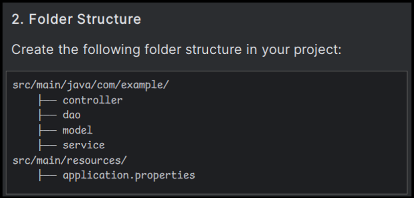

Go to `Movie.java` entity have some problems, lets use Copilot Inline to Fix the errors.


Fix usage on Copilot Inline (Ctrl/Cmd + Shift + G)


Add the changes on the entity, ask Copilot to fix using Lombok.


Using *Copilot Chat* Simplify the *Entity* using *Lombok*.

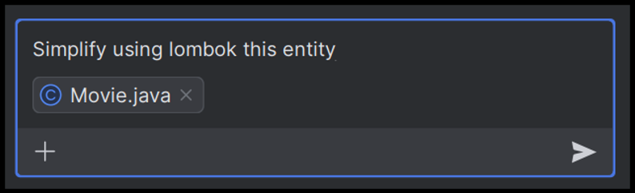

This gave us the update entity but using Data, which has a lint we can use Copilot Inline again to ask for a /fix.


On the service we can use Copilot to understand some lints using @Autowired.


Make the changes in **MovieController** and **MovieService** to not use **@Autowired**.

### Troubleshooting

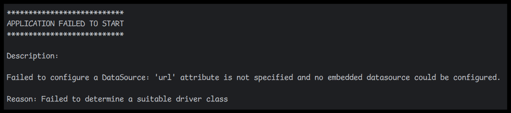

Ask to **Copilot how to Fix this problem**.

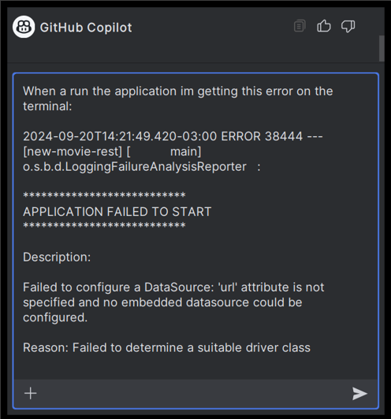

To solve this problem, add the changes that Copilot suggests.

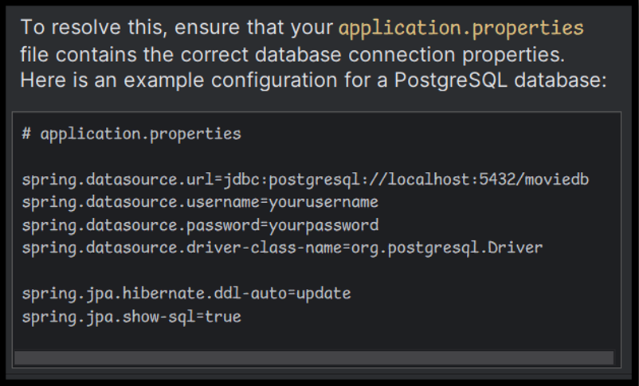

The problem still because we need to also create a Postgres container, we can use **Copilot CLI** to how to run a container, if you don’t have installed yet, do it 😊 later, we can also use the Chat so no problem.

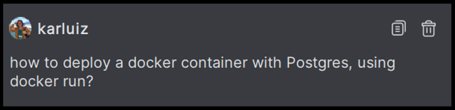

We can add **application.properties** as context to get password, port and other stuff ready.

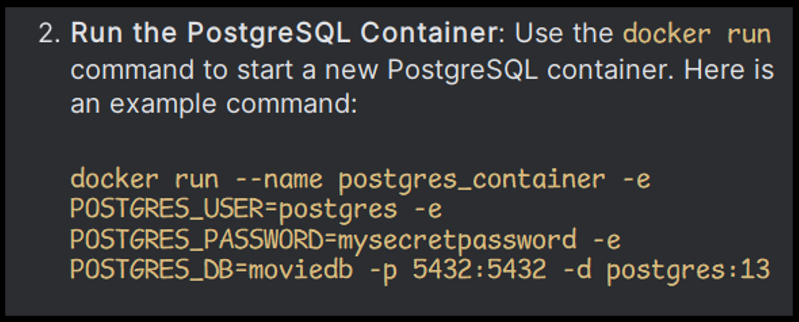

## Step 2: Flyway Support for Seeder

As we can see in the old Solution, we have a **Seeder.sql** with some information about the movies that we need to load.

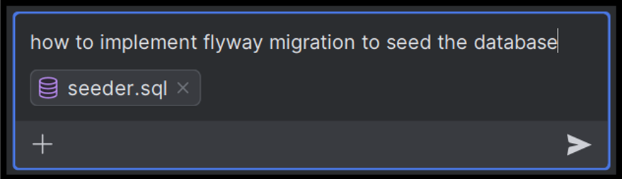

Perform the steps.

### Add flyways dependency


Create the **V2__Initial_Setup.sql** for Seed the Database.

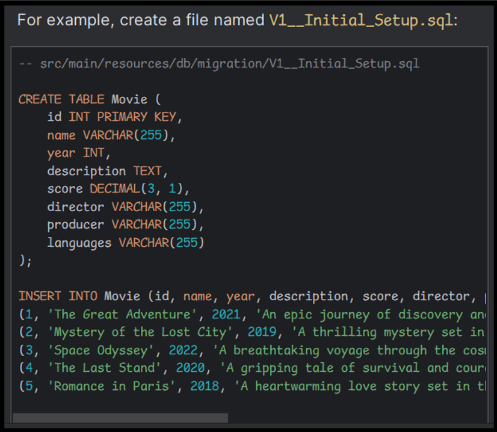

Run the application and check the seed migration is working.

### Troubleshooting

Flyways have some problems with the latest PostgresSQL Database, so you need to use this dependency to load beans that are needed.

```xml
<dependency>
     <groupId>org.flywaydb</groupId>
     <artifactId>flyway-database-postgresql</artifactId>
</dependency>
```

**Unsupported Postgres 16.x**

```xml	
<dependency>
     <groupId>org.flywaydb</groupId>
     <artifactId>flyway-core</artifactId>
     <version>10.15.2</version>
</dependency>
```

Also make sure the entity has the same properties using the chat and adding as a reference the SQL initial file on migrations.

> Try adding by using Copilot Chat or Suggestions.

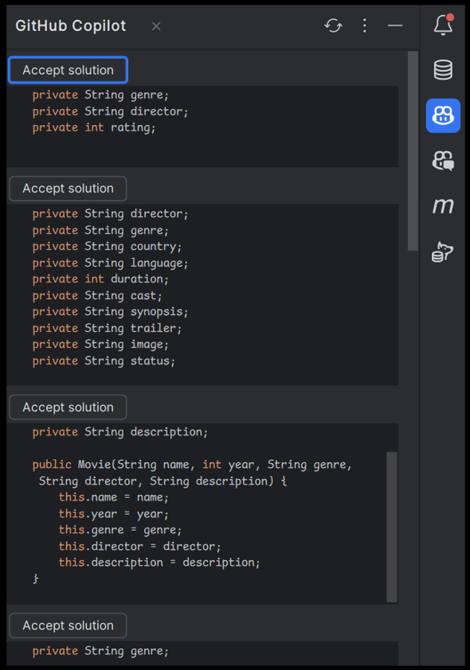

## Step 3: Add Validations and Using Java Stream on Service

We will be going to add Java Stream support to make validations to our methods.

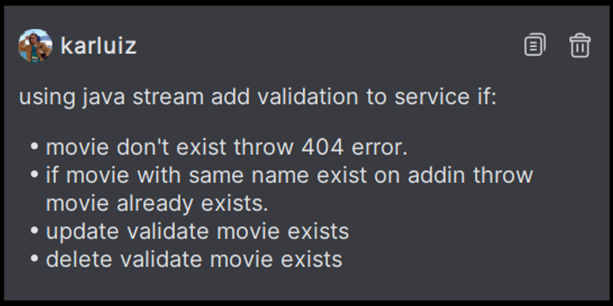

```plaintext
Using java stream add validations to service:
- If a movie doesn’t exist throw 404 error.
- If a movie with the same name exists on adding throw movie already exists.
- Updates validate if a movie exists.
- Delete validate if a movie exists.
```

Add the modifications to have the validations on our MovieService.

Separate Logic in **MovieServiceImpl** and **MovieService**.

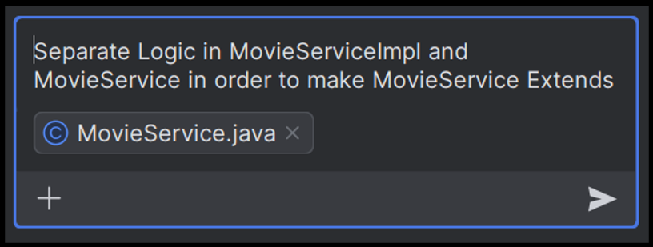

You also will see some follow-up questions like.


## Step 4: Add Junit Testing

We are going to ask Copilot how to add Junit Support for MovieService.

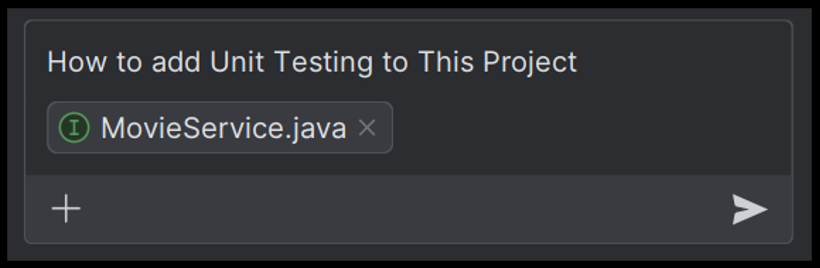

Follow the instructions to add Junit Support and Run the Test.

- **Dependencies**: Add JUnit and Mockito dependencies to pom.xml.
- **Test Class**: Create a test class MovieServiceImplTest with unit tests for each method in MovieServiceImpl.
- **Mocking**: Use Mockito to mock the MovieRepository and inject it into MovieServiceImpl.
- **Assertions**: Use JUnit assertions to verify the behavior of the service methods.

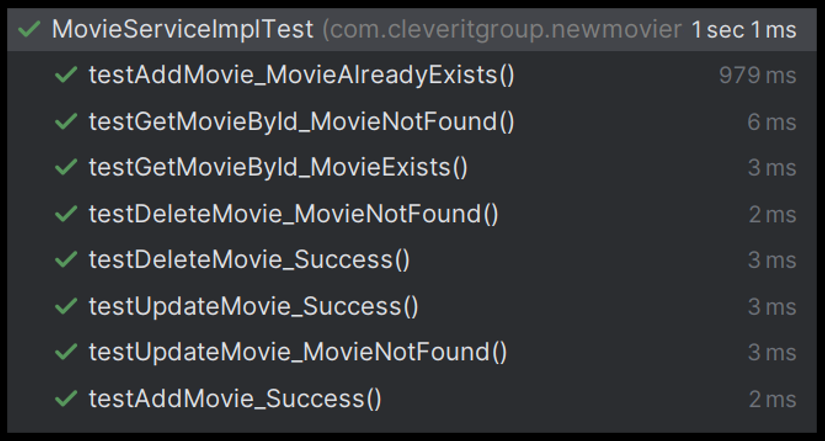

## Step 5: Adding Swagger Documentation

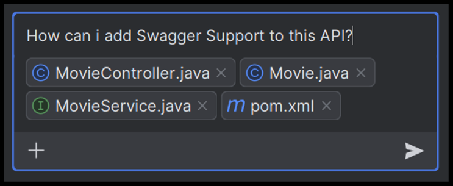

This example is intended to fail, we see here how copilot doesn’t have updated the spring-doc documentation and tries to use old version of swagger; in fact, I must google it to fix the error of dependencies.

### Troubleshooting

We only must add this dependency to have already defined our Swagger.

```xml
<dependency>
    <groupId>org.springdoc</groupId>
    <artifactId>springdoc-openapi-starter-webmvc-ui</artifactId>
    <version>2.5.0</version>
</dependency>
```

And we can see our Swagger doc at: 

- http://localhost:8080/swagger-ui/index.html

## Step 6: Add Documentation using Inline & Chat

We will be going to add Java Stream support to make validations to our methods.

Using Copilot Inline **Ctrl/Cmd + Shift + G** to add the documentation.

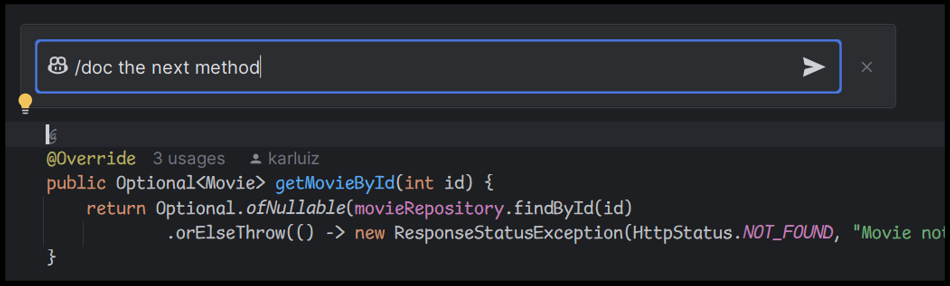

Or using the chat, grab the **MovieServiceImpl** to the Chat and make a prompt using /doc.

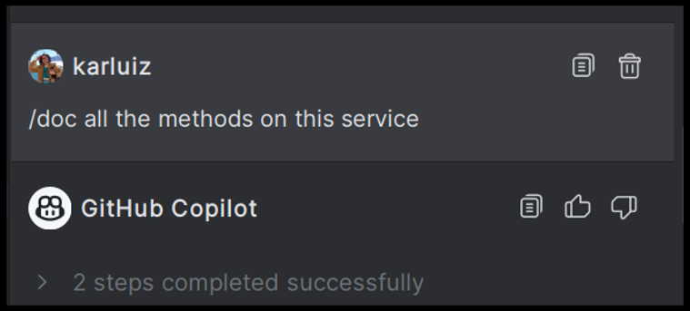

Copy the result and compare with the Clipboard by doing right click.

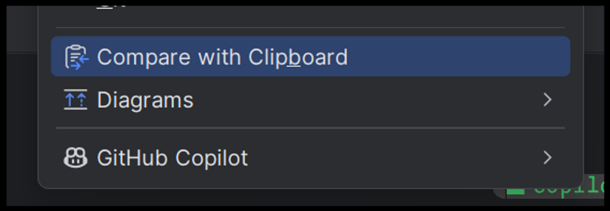

This is very useful to accept the changes one by one.

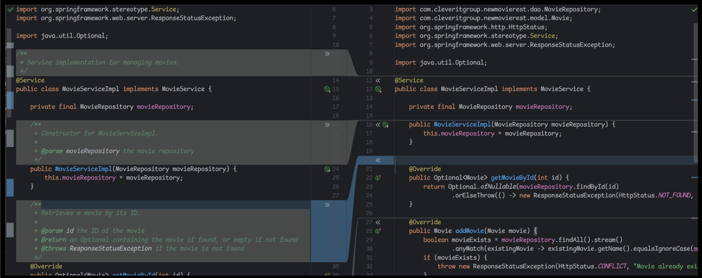

## Add getAllMovies method and Add Test 

Try using mostly copilot add the method getAllMovies and add unit testing.

## ⚠️ Security Issues

Copilot can also give information about security Issues on our Code.


> By using the repository methods provided by Spring Data JPA, you ensure that your queries are parameterized and safe from SQL injection.

## Useful Tips

- **REGX**: It will generate REGX for Validation. You just need to specify criteria. vice versa will help to understand existing REGX meaning
- **Transpose DTO**: Write code to transpose One DTO to Another.
- Post error and will get solution in copilot chat window.
- Provide dummy data and object mocking for you to simplify Unit Tests
- Sonar bug free code (try-with-resources for efficient handling of resources, Optional to avoid null pointer exceptions)
- **Generating Boilerplate Code**: creating a new class with getters, setters, equals(), hashCode(), and toString() methods
- Writing SQL Queries
- **Multithreading**: GitHub Copilot can suggest appropriate Java code for creating and managing threads, handling synchronization, and avoiding common concurrency issues
- **Working with Files and I/O**: GitHub Copilot can provide code snippets for common tasks related to files and I/O in Java, such as reading a file line by line, or writing to a file.
- **Working with JSON**: code snippets for parsing JSON, creating JSON objects, or converting between JSON and Java objects using libraries like Jackson or Gson.
- **Code Review**: Just need to mention method name over chat. 


