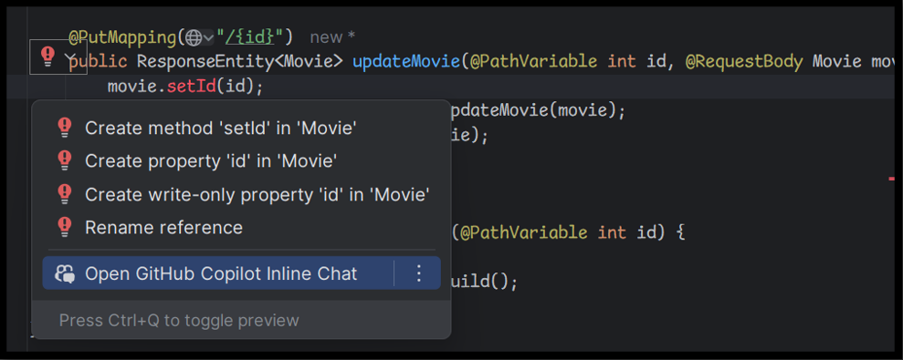
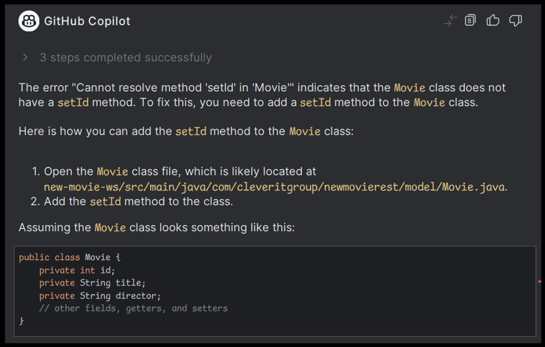
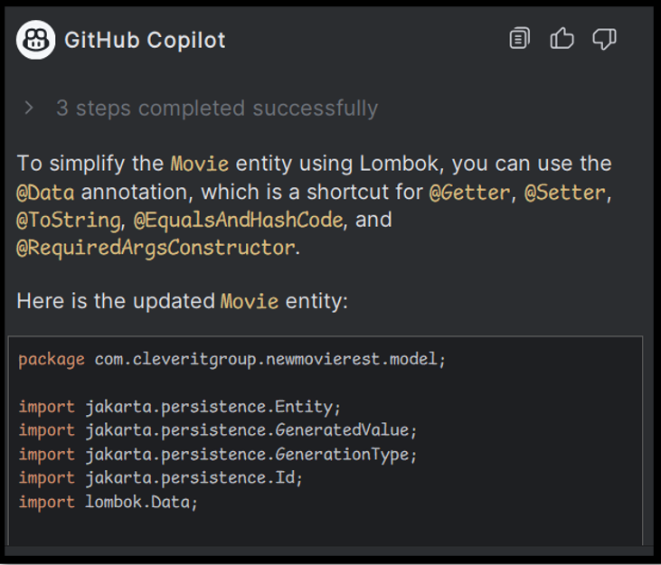
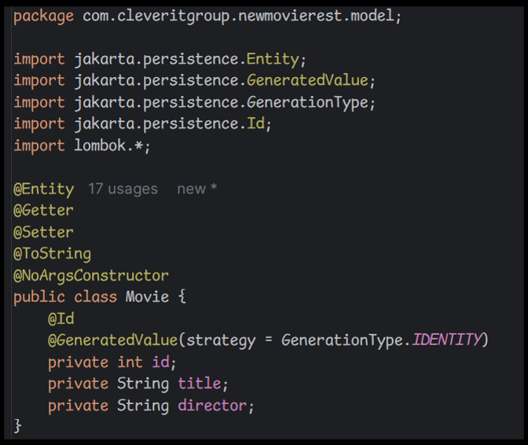
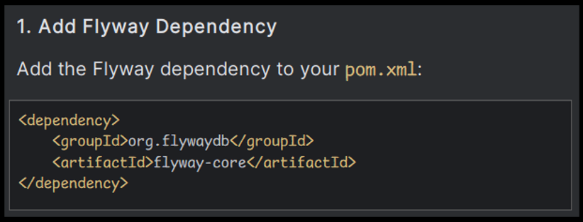
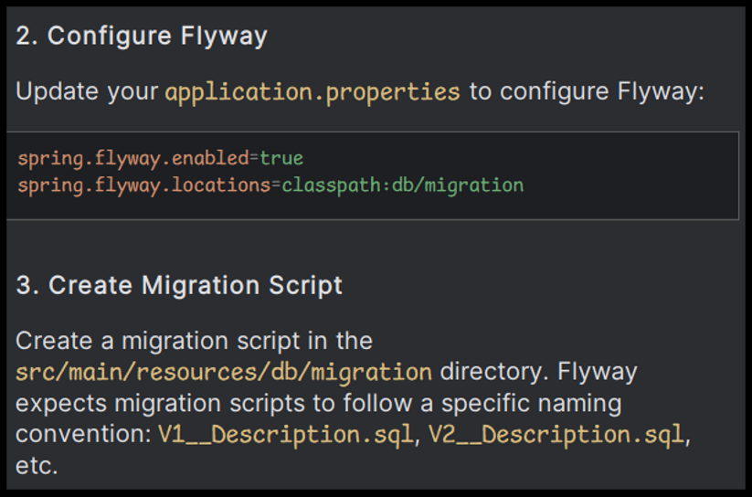

# Demostración de Migración de Java IntelliJ con Copilot

*Actividad*: tenemos un antiguo servicio web que gestionaba la creación de películas, este debe ser migrado con la ayuda de Copilot a una aplicación Spring Boot, añadiendo pruebas unitarias y documentación.
Primero, necesitamos clonar el repositorio:
Cada paso tiene una rama con el paso resuelto.
El objetivo es practicar usando las características que GH Copilot tiene para IntelliJ JetBrains hoy. (23/9/2024)

## Requisitos

- Java 11
- Java 17
- Maven
- Docker para Desktop (para ejecutar PostgreSQL)
- IDE (IntelliJ IDEA y Visual Studio Code)

## Paso 1: Estructura de Carpetas

Comenzamos creando nuestra estructura de carpetas basada en el siguiente prompt.

👤Prompt:
```plaintext
Hola Copilot, necesito ayuda para migrar un servicio web SOAP de películas a un servicio web REST usando Spring Boot, ¿podrías ayudarme a crear un plan de estrategia de migración?
Ay√∫dame con la estructura de carpetas que necesito crear para tener las mismas funcionalidades que ya existen en el servicio SOAP.
Nota: usa Jakarta en lugar de Javax. Usa com.cleveritgroup.newmovierest como nombre de paquete
```

Copilot mostrará qué estructura de carpetas crear

### Realizar los pasos

Crear paquetes dentro de `new-movie-ws/src/main/java/com.cleveritgroup.newmovierest`; para obtener la estructura de carpetas y las clases necesarias.

⚠️⚠ Es posible que copilot no genere la misma estructura de carpetas, pero podemos usar las sugerencias para obtener la estructura correcta.


Ir a la entidad `Movie.java` que tiene algunos problemas, usemos Copilot Inline para corregir los errores.



Corregir el uso en Copilot Inline (Ctrl/Cmd + Shift + G)



Agregar los cambios en la entidad, pedir a Copilot que corrija usando Lombok.



Usando *Copilot Chat* simplificar la *Entidad* usando *Lombok*.

👤Prompt:
```plaintext
Simplificar usando Lombok esta entidad
```

Esto nos dio la entidad actualizada pero usando Data, lo cual tiene un lint que podemos usar Copilot Inline nuevamente para pedir una /corrección.

👤Prompt:
```plaintext
/fix Usar @Data para entidades JPA no es recomendable. Puede causar problemas graves de rendimiento y consumo de memoria. 
```




👤Prompt:
```plaintext
La inyección de campos no es recomendada. ¿Qué puedo hacer?
```
La idea es evitar usar autowired 

Hacer los cambios en **MovieController** y **MovieService** para no usar **@Autowired**.

una vez hecho los cambios, podemos ejecutar la aplicación y verificar que todo esté funcionando. Para ello, podemos irnos
a la clase NewMovieRestApplication y hacer click en el botón de ejecutar, al lado del nombre de la clase.

### Solución de problemas


Preguntar a **Copilot cómo solucionar este problema**.

👤Prompt:
```plaintext
Tengo este error al ejecutar la app:
APPLICATION FAILED TO START  <hr></hr> Description:  Failed to configure a DataSource: 'url' attribute is not specified and no embedded datasource could be configured.  Reason: Failed to determine a suitable driver class
```
Para resolver este problema, agregar los cambios que sugiere Copilot.

⚠️ Es posible que copilot de algunas propiedades distintas, pero podemos usar las sugerencias para obtener la solución correcta.
```
# application.properties
spring.application.name=new-movie-rest

spring.datasource.url=jdbc:postgresql://localhost:5432/moviedb
spring.datasource.username=postgres
spring.datasource.password=mysecretpassword
spring.jpa.hibernate.ddl-auto=update
spring.jpa.show-sql=true
```

El problema persiste porque también necesitamos crear un contenedor de Postgres, podemos usar **Copilot CLI** para saber cómo ejecutar un contenedor, si aún no lo tienes instalado, hazlo 😊 más tarde, también podemos usar el Chat, así que no hay problema.

👤Prompt:
```plaintext
Cómo desplegar un contenedor de Docker con Postgres, usando `docker run`:
```

Podemos agregar **application.properties** como contexto para obtener la contraseña, el puerto y otras cosas listas.


## Paso 2: Soporte de Flyway para Seeder

Como podemos ver en la solución antigua, tenemos un **Seeder.sql** con información sobre las películas que necesitamos cargar.

👤Prompt:
```plaintext
cómo implementar la migración de flyway para sembrar la base de datos
```

Adjuntar seeder.sql que se enncuentra en la carpeta resources/db/migration, al chat de copilot.

Realizar los pasos.

### Agregar dependencia de flyway





Crear el **V2__Initial_Setup.sql** para sembrar la base de datos.


application.properties
```
spring.application.name=new-movie-rest

spring.datasource.url=jdbc:postgresql://localhost:5432/moviedb
spring.datasource.username=postgres
spring.datasource.password=mysecretpassword
spring.datasource.driver-class-name=org.postgresql.Driver

spring.flyway.enabled=true
spring.flyway.url=jdbc:postgresql://localhost:5432/moviedb
spring.flyway.user=postgres
spring.flyway.password=mysecretpassword
spring.flyway.locations=classpath:db/migration
spring.flyway.baseline-on-migrate=true
```

Verificar si la entidad `Movies` tiene los mismos atributos que el script SQL de seeder. Si hay diferencias, podemos usar copilot para incorporarlas en la entidad antes de ejecutar la aplicación.

> Intenta agregar usando Copilot Chat o Sugerencias.


Ejecutar la aplicación y verificar que la migración de semillas esté funcionando.

### Solución de problemas

Flyway tiene algunos problemas con la √∫ltima base de datos de PostgresSQL, por lo que necesitas usar esta dependencia para cargar los beans necesarios.

```xml
<dependency>
     <groupId>org.flywaydb</groupId>
     <artifactId>flyway-database-postgresql</artifactId>
</dependency>
```

**Postgres 16.x no compatible**

```xml	
<dependency>
     <groupId>org.flywaydb</groupId>
     <artifactId>flyway-core</artifactId>
     <version>10.15.2</version>
</dependency>
```
**Flyway no se ejecuta porque no se detectó tabla de historial de esquemas**

A veces copilot no sugiere que Flyway debe tener una tabla de historial de esquemas creada, utilizada para rastrear todos los cambios realizados sobre el esquema. Usar esta configuración en `application.properties` configurará para que flyway cree la tabla.

```plaintext
spring.flyway.baseline-on-migrate=true
```
**Flyway no se ejecuta cuando presiono el botón de ejecutar**

A veces flyway no se ejecutará después de ejecutar la aplicación. Por lo tanto, no se ejecutará ninguna migración. Si esto sucede, podemos ejecutar las migraciones usando el terminal con el siguiente comando:
```sh
./mvnw c
```
Esto usará el wrapper de maven para ejecutar flyway en su lugar. **RECUERDA SUSTITUIR LOS VALORES DE LOS PARÁMETROS**

## Paso 3: Agregar Validaciones y Usar Java Stream en el Servicio

Vamos a agregar soporte de Java Stream para hacer validaciones a nuestros métodos.

👤Prompt:
```plaintext
Usando java stream agrega validaciones al servicio:
- Si una película no existe, arroja un error 404.
- Si una película con el mismo nombre existe al agregar, arroja un error comentando que la película ya existe.
- Las actualizaciones validan si una película existe.
- Eliminar valida si una película existe.
```
Agregar archivo MovieService al chat de copilot.

Agregar las modificaciones para tener las validaciones en nuestro MovieServices, agregar tambien modificaciones en MovieController.


Separar la lógica en **MovieServiceImpl** y **MovieService**.

👤 Prompt: 
```
Separa la logica de este servicio en MovieServiceImpl y MovieService
```
Agregar archivo Movie Service al chat de copilot.


## Paso 4: Agregar Pruebas Junit

Vamos a pedir a Copilot cómo agregar soporte Junit para MovieService.

👤Prompt:
```plaintext
Cómo agregar pruebas unitarias a este proyecto usnado Junit?
```


Sigue las instrucciones para agregar soporte Junit y ejecutar la prueba.

- **Dependencias**: Agregar dependencias de JUnit y Mockito a pom.xml.
- **Clase de Prueba**: Crear una clase de prueba MovieServiceImplTest con pruebas unitarias para cada método en MovieServiceImpl.
- **Simulación**: Usar Mockito para simular el MovieRepository e inyectarlo en MovieServiceImpl.
- **Aserciones**: Usar aserciones de JUnit para verificar el comportamiento de los métodos del servicio.


## Paso 5: Agregar Documentación Swagger

👤Prompt:
```plaintext
Cómo agregar documentación Swagger a esta API?
```

Este ejemplo está destinado a fallar, vemos aquí cómo copilot no ha actualizado la documentación de spring-doc e intenta usar una versión antigua de swagger; de hecho, tuve que buscar en Google para corregir el error de dependencias.

### Solución de problemas

Solo debemos agregar esta dependencia para tener ya definida nuestra Swagger.

```xml
<dependency>
    <groupId>org.springdoc</groupId>
    <artifactId>springdoc-openapi-starter-webmvc-ui</artifactId>
    <version>2.5.0</version>
</dependency>
```

Y podemos ver nuestra documentación Swagger en:

- http://localhost:8080/swagger-ui/index.html

## Paso 6: Agregar Documentación usando Inline & Chat

Vamos a agregar soporte de Java Stream para hacer validaciones a nuestros métodos.

Usando Copilot Inline **Ctrl/Cmd + Shift + G** para agregar la documentación.

👤Prompt:
```plaintext
/doc el siguiente metodo
```

O usando el chat, arrastra el **MovieServiceImpl** al Chat y haz un prompt usando /doc.

👤Prompt:
```plaintext
/doc todos los metodos en este servicio
```
adjuntar el archivo de servicio.


Copia el resultado y comp√°ralo con el Portapapeles haciendo clic derecho.


Esto es muy √∫til para aceptar los cambios uno por uno.


## Agregar método getAllMovies y Agregar Prueba

Intenta usar principalmente copilot para agregar el método getAllMovies y agregar pruebas unitarias.

## ⚠️ Problemas de Seguridad

Copilot también puede dar información sobre problemas de seguridad en nuestro código.


> Al usar los métodos del repositorio proporcionados por Spring Data JPA, aseguras que tus consultas estén parametrizadas y sean seguras contra inyecciones SQL.

## Consejos √ötiles

- **REGX**: Generará REGX para validación. Solo necesitas especificar los criterios. viceversa ayudará a entender el significado del REGX existente.
- **Transponer DTO**: Escribir código para transponer un DTO a otro.
- Publicar error y obtener solución en la ventana de chat de copilot.
- Proporcionar datos ficticios y simulación de objetos para simplificar las pruebas unitarias.
- Código libre de errores de Sonar (try-with-resources para manejo eficiente de recursos, Optional para evitar excepciones de puntero nulo).
- **Generación de Código Boilerplate**: crear una nueva clase con getters, setters, equals(), hashCode() y métodos toString().
- Escribir Consultas SQL.
- **Multithreading**: GitHub Copilot puede sugerir código Java apropiado para crear y gestionar hilos, manejar la sincronización y evitar problemas comunes de concurrencia.
- **Trabajar con Archivos y E/S**: GitHub Copilot puede proporcionar fragmentos de código para tareas comunes relacionadas con archivos y E/S en Java, como leer un archivo línea por línea o escribir en un archivo.
- **Trabajar con JSON**: fragmentos de código para analizar JSON, crear objetos JSON o convertir entre JSON y objetos Java usando bibliotecas como Jackson o Gson.
- **Revisión de Código**: Solo necesitas mencionar el nombre del método en el chat.
